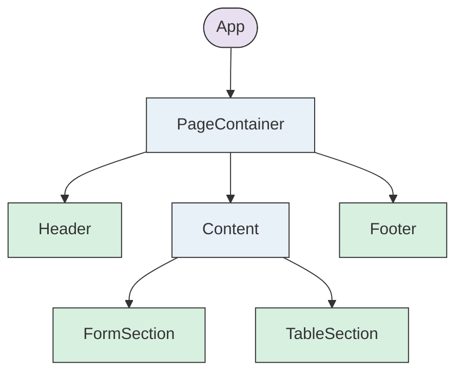
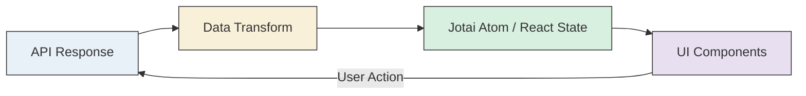
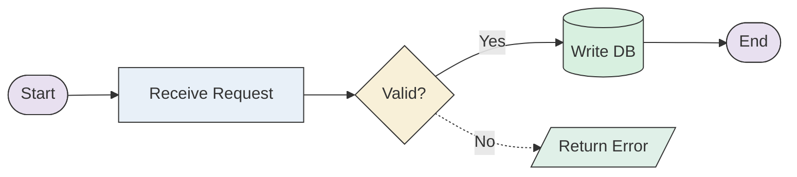
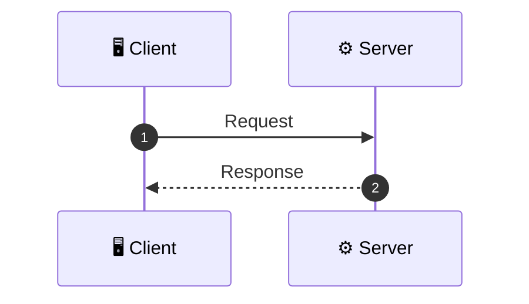
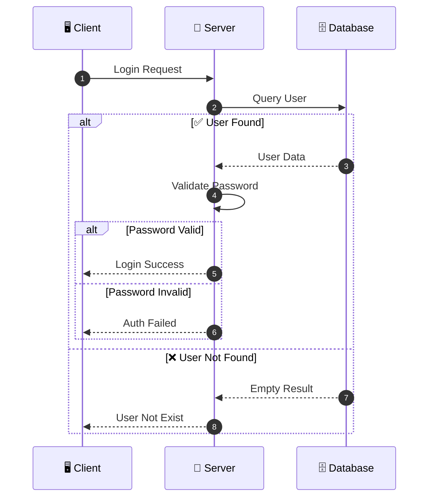
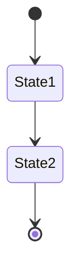
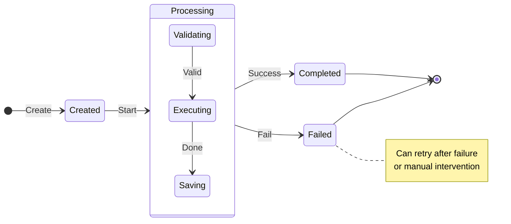

## User Input

```text
$ARGUMENTS
```

You **MUST** consider the user input before proceeding (if not empty).

If the given `$ARGUMENTS` contains a link, you need to read the content of the link (use lark-docs mcp if it's a lark doc) and replace the link with content.

## Step 0: Ask User for TDD Type

**IMPORTANT**: Before proceeding with any generation, you MUST ask the user which type of Technical Design Document they want to generate.

Use the AskUserQuestion tool with the following question:

```
Question: "Which type of Technical Design Document do you want to generate?"
Options:
  - "Frontend TDD" - Generate frontend technical design (React components, hooks, UI/UX)
  - "Backend TDD" - Generate backend technical design (APIs, database, system architecture)
```

Based on the user's selection:
- **Frontend TDD** → Follow the [Frontend TDD Generation Flow](#frontend-tdd-generation-flow)
- **Backend TDD** → Follow the [Backend TDD Generation Flow](#backend-tdd-generation-flow)

---

## Common Context (Both Frontend and Backend)

**Read context before Executing**:

1. **Language Setting** ⚠️ **CRITICAL - MUST READ FIRST**

   - **STEP 1**: Read `.ttadk/config.json` file and extract `preferred_language` value
   - **STEP 2**: If file missing or field missing, default to `'en'`
   - **STEP 3**: Store the language setting and apply it to ALL outputs

   **Language Mapping** (STRICTLY FOLLOW):
   | Config Value | Output Language | Example Section Title |
   |:-------------|:----------------|:---------------------|
   | `'zh'` | **Chinese (中文)** | `## 1. 业务背景` |
   | `'en'` | **English** | `## 1. Business Background` |

   **What MUST be in the configured language**:

   - ✅ All section titles and headings
   - ✅ All descriptive text and explanations
   - ✅ All table headers and content
   - ✅ All diagram labels and node text (flowchart, sequence, ER, component)
   - ✅ All comments in code blocks
   - ✅ Lark document title

   **What stays in English** (technical terms):

   - Code identifiers (variable names, function names, component names)
   - SQL keywords, Mermaid syntax keywords, React/TypeScript keywords
   - PSM names, API paths, Package names
   - CSS class names, Tailwind utilities

   **⚠️ VIOLATION CHECK**: If `preferred_language` is `'zh'` but output contains English section titles like "Business Background" instead of "业务背景", this is a **CRITICAL ERROR** - regenerate immediately.

2. **Reference Setting**
   - Load tech stack references from plan.md's Technical Context section. Use these references for technical design decisions and architecture patterns.
   - **Frontend Stack Reference**: Prioritize `CLAUDE.md`; if it is unavailable or lacks the needed guidance, then refer to the project's existing architecture and current tech stack choices

---

## Frontend TDD Generation Flow

> Use this flow when user selects **Frontend TDD**

### Frontend Outline

1. **Setup**: Run `node .ttadk/plugins/ttadk/core/resources/scripts/check-prerequisites.js --json` from repo root and parse JSON for FEATURE_DIR and AVAILABLE_DOCS. All paths must be absolute.

2. **Load design artifacts**: Read all available documents from FEATURE_DIR:

   - **Primary sources**: spec.md, plan.md, research.md
   - **Secondary sources**: contracts/, checklists/, quickstart.md, tasks.md, any other .md files
   - **Note**: Focus on frontend-related designs, UI/UX specifications, and component requirements

3. **Load template**: Load `.ttadk/plugins/ttadk/core/resources/templates/technical-design-frontend-template.md` to understand the required structure and sections for frontend technical design.

   - **CRITICAL**: The template defines the standard sections and format - follow its structure but generate content based on spec.md/plan.md!

4. **Check existing TDD**: Before generating, check if `FEATURE_DIR/technical-design.md` already exists:

   - **If exists**: **COMPLETELY OVERWRITE** - Generate entirely new content from scratch, do NOT read or modify existing content.
   - **If not exists**: Generate new document from scratch.
   - **CRITICAL**: Always generate from scratch based on source documents (spec.md, plan.md, etc.). Never attempt to edit or merge with existing content.
   - **CRITICAL**: Always use `preferred_language` from config for language selection, regardless of whether file exists.

5. **Generate Frontend TDD**: Follow the frontend-specific structure below to generate comprehensive technical documentation.

   - Always use `preferred_language` from `.ttadk/config.json` for language selection.
   - **IMPORTANT**: Upsert mode - no need to ask user for confirmation.

   **Document Header**:

   - Start with quote: `> Generated by **TTADK** (TikTok Agent Development Kit)`
   - **IMPORTANT**: Do NOT add `# Title` at the beginning - the Lark document title serves as the main heading
   - Do NOT include: Feature ID, date, status, or other metadata headers
   - **DO NOT copy template instructions** - instructional blocks are for your reference only

   **Required Sections** (Follow `technical-design-frontend-template.md` structure):

   - **1. Reference // 引用**: Links to PRD, Figma, Meego, Starling, Event Tracking, Test Case, etc.
   - **2. Background // 背景**: Extract from spec.md, plan.md
     - Project background, core problems, business domain, target users, expected outcomes
   - **3. Solutions // 技术方案**:
     - **3.1 Architectural Design // 架构设计**: Architecture diagram, flowchart, key technology selection
     - **3.2 Functional Module Division // 功能模块划分**: Module list with UI, requirement details, technical details
     - **3.3 Common Module // 公共模块**: New/modified components, scope of use - **Only if** applicable
     - **3.4 Tech Details // 技术细节**: State management, routing, data storage, optimization strategies
     - **3.5 Schema and Params // 页面 Schema 及传参** - **Only if** C-side pages
     - **3.6 Event Tracking // 埋点**: Required - whether event tracking needed, doc link
     - **3.7 Monitoring // 监控** - **Only if** applicable
   - **4. Schedule // 排期**: Development schedule, module owners, time estimates, risks
   - **5. Risk Assessments // 风险评估**:
     - **5.1 Business and Architecture**: Code migration, arch upgrades, engineering upgrades, incompatible changes
     - **5.2 Dependence // 公共&外部依赖**: Routing changes, component library changes, npm package changes
     - **5.3 Other Config Change**: Goofy, TCC, Starling, TLB, Libra
   - **6. Test Instruction // 测试说明**: Testing environment, plan, key testing points
   - **7. Release Plan // 上线方案**: Libra A/B, rollback plan - **Only if** applicable
   - **8. Tech Review TODOs // 技术评审 TODOs**: Pending issues, review TODOs

   **Conditional Section Rules**:

   - If a section type is not relevant (e.g., no form, no animations), **completely omit** that subsection
   - If new frontend concerns exist that aren't in the template, **add them** to the appropriate section
   - Empty sections should be removed, not left with "N/A" placeholders

6. **Write output**: Use the **Write tool** to save to `FEATURE_DIR/technical-design.md`. This will completely overwrite any existing file. Do NOT use Edit tool - always use Write tool to ensure full replacement.

7. **Validate Mermaid diagrams**: After writing the file, perform **static syntax validation** on ALL Mermaid code blocks (see [Mermaid Validation Rules](#mermaid-validation-rules)).

8. **Upload to Lark**: After successfully writing the local file, upload the document to Feishu/Lark:
   - Use MCP tool `mcp__lark-docs__import_markdown_to_lark` with parameters:
     - `filePath`: Absolute path to `FEATURE_DIR/technical-design.md`
     - `title`: **IMPORTANT** - Generate a concise, descriptive title:
       - Use the language matching `preferred_language` setting
       - Keep it brief (ideally under 30 characters)
       - Add "[Frontend]" prefix to indicate frontend design
       - Examples: "[Frontend] Merchant Ads Module", "[Frontend] User Profile Page"
   - Store the returned Lark document URL for the next step
   - If upload fails, continue with local file generation success and note the error

9. **Open Lark document in browser**: If Lark upload succeeded, automatically open the Lark document URL in the user's default browser:

   - Use `open LARK_URL` command (macOS) or equivalent for the platform

10. **Update local file with Lark link**: If Lark upload succeeded, prepend the Lark document URL to the beginning of `FEATURE_DIR/technical-design.md`:

    - Add the following line at the very top of the file (before the TTADK quote):

      ```
      > 📄 **Lark Document**: [View on Lark](LARK_URL)

      ```

    - Replace `LARK_URL` with the actual Lark document URL returned from step 8

11. **Report completion**: Output a concise summary with key information (see [Completion Report Format](#completion-report-format)).

---

## Backend TDD Generation Flow

> Use this flow when user selects **Backend TDD**

### Backend Outline

1. **Setup**: Run `node .ttadk/plugins/ttadk/core/resources/scripts/check-prerequisites.js --json` from repo root and parse JSON for FEATURE_DIR and AVAILABLE_DOCS. All paths must be absolute.

2. **Load design artifacts**: Read all available documents from FEATURE_DIR:

   - **Primary sources**: spec.md, plan.md, data-model.md, research.md
   - **Secondary sources**: contracts/, checklists/, quickstart.md, tasks.md, any other .md files
   - **Note**: Only focus on documents within the spec directory, no need to search external database schema files

3. **Load template**: Load `.ttadk/plugins/ttadk/core/resources/templates/technical-design-template.md` to understand the required structure and sections.

   - **CRITICAL**: The template is for understanding structure ONLY - do NOT copy or use template content directly!

4. **Check existing TDD**: Before generating, check if `FEATURE_DIR/technical-design.md` already exists:

   - **If exists**: **COMPLETELY OVERWRITE** - Generate entirely new content from scratch, do NOT read or modify existing content.
   - **If not exists**: Generate new document from scratch.
   - **CRITICAL**: Always generate from scratch based on source documents (spec.md, plan.md, etc.). Never attempt to edit or merge with existing content.
   - **CRITICAL**: Always use `preferred_language` from config for language selection, regardless of whether file exists.

5. **Generate TDD**: Follow the template structure to generate comprehensive technical documentation.

   - Always use `preferred_language` from `.ttadk/config.json` for language selection.
   - **IMPORTANT**: Upsert mode - no need to ask user for confirmation.

   **Document Header**:

   - Start with quote: `> Generated by **TTADK** (TikTok Agent Development Kit)`
   - **IMPORTANT**: Do NOT add `# Title` at the beginning - the Lark document title serves as the main heading
   - Do NOT include: Feature ID, date, status, or other metadata headers
   - **DO NOT copy template instructions** - The template contains instructional blocks (Document Guidelines, Mermaid Syntax Requirements) that are for your reference only. These MUST NOT appear in the generated document.

   **Required Sections** (follow template structure order):

   - **1. Business Background**: Extract from spec.md, plan.md, research.md
     - Objective, Measurable Targets (concise, no document reference links)
   - **2. Requirement Analysis**: Extract from spec.md, plan.md
     - Current Status (brief description, no pain points)
     - Business Goals
     - Feature Module Division (no priority levels)
     - Use Case Diagram - **Only if** multiple user roles involved
   - **3. System Design**: Architecture and data structures
     - Network Topology - **Only if** distributed system
     - Overall Architecture Diagram - Use **Mermaid** graph, highlight changes in red
     - Data Synchronization - **Only if** cross-system data sync involved
     - Domain Model / ER Diagram - **Only if** data model changes exist (tables must display in single line on Lark)
     - Schema Definitions - **Only include relevant subsections**:
       - Database Tables - Only if DB changes involved
       - Elasticsearch Index - Only if ES changes involved
       - Cache Structure - Only if cache changes involved
       - MQ Messages - Only if MQ changes involved
       - Configuration - Only if TCC/config changes involved
   - **4. Core Changes**: Interface flow and implementation details
     - For each interface/change point (use `### 4.x` heading only, NO sub-headings like `#### 4.1.1`):
       - **Flowchart** (Mermaid graph) - ONE comprehensive flowchart combining all flows (main, branch, exception)
       - **Sequence Diagram** (Mermaid sequenceDiagram) - shows system interactions with alt/else for branches
       - **Field Change Table** - describes field changes, read/write logic
     - Async flows (MQ consumers, background jobs) should be separate interface sections
     - State Diagram - **Only if** state transitions are involved
     - Interface Definitions - **Only if** API/RPC changes exist (format: PSM + Method, then request/response body, with separator after each interface)
   - **5. Checklist**: DDL changes and resource application tasks only (no priority levels)

   **Conditional Section Rules**:

   - If a schema type is not affected (e.g., no ES changes), **completely omit** that subsection
   - If new change types exist that aren't in the template, **add them** to the appropriate section
   - Empty sections should be removed, not left with "N/A" placeholders

6. **Write output**: Use the **Write tool** to save to `FEATURE_DIR/technical-design.md`. This will completely overwrite any existing file. Do NOT use Edit tool - always use Write tool to ensure full replacement.

7. **Validate Mermaid diagrams**: After writing the file, perform **static syntax validation** on ALL Mermaid code blocks (see [Mermaid Validation Rules](#mermaid-validation-rules)).

8. **Upload to Lark**: After successfully writing the local file, upload the document to Feishu/Lark:
   - Use MCP tool `mcp__lark-docs__import_markdown_to_lark` with parameters:
     - `filePath`: Absolute path to `FEATURE_DIR/technical-design.md`
     - `title`: **IMPORTANT** - Generate a concise, descriptive title that summarizes the feature's core purpose:
       - Use the language matching `preferred_language` setting (zh → Chinese, en → English)
       - Keep it brief (ideally under 30 characters)
       - Focus on WHAT the feature does, not technical implementation details
       - Examples: "User Auth Module Design", "Payment Gateway Integration", "Order State Machine Refactor"
       - Do NOT just use the folder name - summarize the actual content
   - Store the returned Lark document URL for the next step
   - If upload fails, continue with local file generation success and note the error

9. **Open Lark document in browser**: If Lark upload succeeded, automatically open the Lark document URL in the user's default browser:

   - Use `open LARK_URL` command (macOS) or equivalent for the platform
   - This allows the user to immediately view and share the uploaded document

10. **Update local file with Lark link**: If Lark upload succeeded, prepend the Lark document URL to the beginning of `FEATURE_DIR/technical-design.md`:

    - Add the following line at the very top of the file (before the TTADK quote):

      ```
      > 📄 **Lark Document**: [View on Lark](LARK_URL)

      ```

    - Replace `LARK_URL` with the actual Lark document URL returned from step 8
    - This ensures the local file always contains the link to its Lark counterpart

11. **Report completion**: Output a concise summary with key information (see [Completion Report Format](#completion-report-format)).

---

## Mermaid Validation Rules

After writing the file, perform **static syntax validation** on ALL Mermaid code blocks:

- **DO NOT use mermaid-cli** - it may not be installed and has version compatibility issues
- For each `mermaid` code block, manually verify against this checklist:

### Validation Checklist

**Flowchart Validation**:

- ✅ Uses `flowchart LR` or `flowchart TD` (not `graph`)
- ✅ Node text with special chars is quoted: `A["Text with spaces"]`
- ✅ Only allowed arrows: `-->`, `-.->`, `==>` (NO `-,->`, `--x`, `--o`)
- ✅ Arrow labels are simple: `-->|Label|` (no `[]`, `<>`, or special chars in labels)
- ✅ Subgraph syntax: `subgraph Name["Title"]` or `subgraph Name`

**Sequence Diagram Validation**:

- ✅ All `alt`/`opt`/`loop` blocks have matching `end`
- ✅ **NO `box` syntax** (not supported in Mermaid 9.x)
- ✅ Participant aliases don't contain special chars

**Component Tree Validation** (Frontend only):

- ✅ Uses `flowchart TD` for top-down component hierarchy
- ✅ Component names follow React naming (PascalCase)

**ER Diagram Validation** (Backend only):

- ✅ Uses `erDiagram` keyword (not `er-diagram` or `ERDiagram`)
- ✅ Data types use simple names: `decimal` not `decimal(10,2)`, `string` not `varchar(255)`
- ✅ **Relationship format**: `ENTITY1 SYMBOL ENTITY2 : "label"` (label in quotes, colon required)
- ✅ **Valid relationship symbols** (left-to-right only):
  - `||--||` (one-to-one)
  - `||--o|` (one-to-zero-or-one)
  - `||--o{` (one-to-many, optional)
  - `||--|{` (one-to-many, required)
  - `}o--o{` (many-to-many)
  - `}|--|{` (many-to-many, both required)
- ✅ **NO invalid symbols**: `|o--o|`, `{|--|{`, `--`, `->`, `<-` are INVALID
- ✅ **Entity names**: Use UPPERCASE or PascalCase, NO spaces, NO special chars
- ✅ **Attribute format**: `type name "comment"` (comment in quotes, under 20 chars)
- ✅ **NO empty entities**: Each entity must have at least one attribute or relationship

**State Diagram Validation** (Backend only):

- ✅ Uses `stateDiagram-v2` keyword
- ✅ State names have no spaces (use aliases: `state "Name" as Alias`)

**If issues found**:

1. Fix the syntax error in the Mermaid code
2. Re-write the corrected content to the file using Write tool
3. Re-validate until all checks pass

**Common Fixes**:

- Unquoted text → Add quotes: `A[Text]` → `A["Text"]`
- Wrong arrow → Replace: `-,->` → `-.->`, `--x` → `-->`
- Complex labels → Simplify: remove `[]`, `<>`, `<br/>`
- `box` syntax → Remove entirely (use comments for grouping instead)
- ER relationship without label → Add label: `A ||--o{ B` → `A ||--o{ B : "1:N"`
- ER invalid symbol → Fix direction: `{o--||` → `||--o{`
- ER decimal type → Simplify: `decimal(10,2)` → `decimal`

---

## Completion Report Format

**Output format based on language setting**:

For `zh` (Chinese):

```
✅ [Frontend/Backend] 技术设计文档生成成功

📋 已包含章节: [列出实际生成的章节]
📊 数据来源: spec.md, plan.md, ...

📁 本地文件: FEATURE_DIR/technical-design.md
🔗 Lark 文档: [Lark URL] (或 "上传失败，请手动上传")

下一步: 邀请团队成员在 Lark 中进行技术方案评审
```

For `en` (English):

```
✅ [Frontend/Backend] Technical Design Document generated successfully

📋 Sections included: [List only sections actually generated]
📊 Data sources: spec.md, plan.md, ...

📁 Local file: FEATURE_DIR/technical-design.md
🔗 Lark document: [Lark URL] (or "Upload failed, please upload manually")

Next step: Invite team members for technical design review in Lark
```

---

## Frontend-Specific Standards

### Frontend-Specific Diagram Standards

**Architecture Diagram** (for Section 3.1):



**Data Flow Diagram** (for Section 3.4):



### Functional Module Table Format (Section 3.2)

| Module // 模块 | UI | Requirement details // 需求细节 | Technical details // 技术细节 |
|:---------------|:---|:--------------------------------|:------------------------------|
| xxx | Screenshot/Figma link | Feature description | Implementation approach |

**Technical details column guidelines**:
- **Component design**: component name, props interface (input), return/render structure (output), and pseudocode for main logic
- Describe page layout framework (e.g., header/content/footer structure)
- List key UI components used (e.g., existing project components, button, modal, table)
- Mention state management approach if relevant
- Keep concise but specific enough for implementation reference

**Example pseudocode format for Components**:
```tsx
// ComponentName
interface Props { shopList: Shop[]; onSelect: (ids: string[]) => void }
// Main logic: filter -> search -> render list
// Return: <List> with checkbox selection
```

### Hooks Technical Details Format (Section 3.4)

When documenting custom hooks, use this code block format with structured comments:

**Example Hook documentation**:
```typescript
// Purpose: Manage todo list state with CRUD operations and persistence
// Input: storageKey (string for localStorage)
// Output: { items, loading, addItem, toggleItem, deleteItem, clearCompleted }
// Logic: Load from localStorage → Manage state → Sync changes back to storage
function useTodoList(storageKey: string) {
  const [items, setItems] = useState<TodoItem[]>([]);
  const [loading, setLoading] = useState(true);

  // Load items from localStorage on mount
  useEffect(() => {
    const stored = localStorage.getItem(storageKey);
    if (stored) setItems(JSON.parse(stored));
    setLoading(false);
  }, [storageKey]);

  // Sync to localStorage on change
  useEffect(() => {
    localStorage.setItem(storageKey, JSON.stringify(items));
  }, [items, storageKey]);

  const addItem = (text: string) => { /* Add new item */ };
  const toggleItem = (id: string) => { /* Toggle completed */ };
  const deleteItem = (id: string) => { /* Remove item */ };

  return { items, loading, addItem, toggleItem, deleteItem };
}
```

**Hook documentation structure**:
1. **Purpose**: One-line description of what the hook does
2. **Input**: Parameters the hook accepts
3. **Output**: Return value structure (destructured object)
4. **Logic**: Step-by-step flow with arrows (→) showing data transformation
5. **Pseudocode**: Simplified implementation showing key API calls and logic flow

### Component Technical Details Format (Section 3.4)

When documenting core components, use this code block format with structured comments:

**Example Component documentation**:
```tsx
// Purpose: Render a todo list with add, toggle, and delete functionality
// Input: initialItems (TodoItem[]), onUpdate (callback)
// Output: JSX - List with input field, todo items, and action buttons
// Logic: Manage local state → Handle add/toggle/delete → Sync with parent
function TodoList(props: { initialItems: TodoItem[]; onUpdate: (items: TodoItem[]) => void }) {
  // Core logic
  const [items, setItems] = useState(props.initialItems);
  const [inputValue, setInputValue] = useState('');
  ...
  const handleAdd = () => { /* Add new item */ };
  const handleToggle = (id: string) => { /* Toggle completed state */ };

  return (
    <div>
      <Input value={inputValue} onChange={setInputValue} />
      <Button onClick={handleAdd}>Add</Button>
      <List dataSource={items} renderItem={(item) => <TodoItem {...item} />} />
    </div>
  );
}
```

**Component documentation structure**:
1. **Purpose**: One-line description of what the component renders
2. **Input**: Props interface the component accepts
3. **Output**: JSX structure description
4. **Logic**: Key rendering logic and state handling
5. **Pseudocode**: Simplified implementation showing core logic and return structure

### Common Module Table Format (Section 3.3)

| Module // 模块 | Add/Modify/Remove // 增/改/删 | Scope of use // 使用范围 | Technical details // 技术细节 |
|:---------------|:------------------------------|:-------------------------|:------------------------------|
| ComponentName | Add | business layer | Props interface, usage example |

### Schedule Table Format (Section 4)

| 需求开发阶段 | PD // 估时 | Owner // 负责人 | Any risk // 风险说明 |
|:-------------|:-----------|:----------------|:--------------------|
| 模块&功能点1 | 3d | | |
| joint debugging // 联调 | 2d | | |

### Risk Assessment Table Format (Section 5)

| Check point // 检查点 | Changes // 改动点 | Action // 措施 |
|:----------------------|:------------------|:---------------|
| Front-end routing changes | ☐ No ☐ Yes | Description of changes |

---

## Backend-Specific Standards

### Flowchart Standards

> Flowcharts display business process flows, use `flowchart LR` (left to right)

#### 1. Structure Guidelines

- Use `flowchart LR` (default left-to-right flow)
- Clearly define phases: **Request Entry → Core Processing → Data Storage → Return Result**
- Main flow must be a clear "single directional main path"
- Use decision nodes (diamond `{}`) for branching logic
- ❌ No messy crossing lines allowed
- ❌ No multiple parallel main paths without convergence points

#### 2. Node Design Standards

| Node Type     | Shape Syntax | Example                |
| :------------ | :----------- | :--------------------- |
| Start/End     | `([Text])`   | `([Start])`, `([End])` |
| Process Step  | `[Text]`     | `[Validate Params]`    |
| Core Module   | `[[Text]]`   | `[[Execute Match]]`    |
| Decision      | `{Text?}`    | `{Valid?}`             |
| Data Storage  | `[(Text)]`   | `[(MySQL)]`            |
| Message Queue | `{{Text}}`   | `{{BMQ}}`              |

**Node Text Guidelines**:

- Each node text should not exceed two lines
- Use verb phrases: `Validate Params` / `Build Features` / `Execute Match`
- ❌ No long descriptions allowed

#### 3. Visual Styling - Color Standards

Use `classDef` to define color tones matching the standard flowchart palette:



| Color        | Class      | Shape      | Usage                 | Hex Value    |
| :----------- | :--------- | :--------- | :-------------------- | :----------- |
| Light Purple | `startEnd` | `([Text])` | Start/End nodes       | fill:#E8E0F0 |
| Light Blue   | `process`  | `[Text]`   | Process steps         | fill:#E8F0F8 |
| Light Yellow | `decision` | `{Text}`   | Decision/branch nodes | fill:#F8F0D8 |
| Light Green  | `storage`  | `[(Text)]` | Database/storage      | fill:#D8F0E0 |
| Mint Green   | `io`       | `[/Text/]` | Input/Output          | fill:#E0F0E8 |
| Light Red    | `error`    | `[Text]`   | Error handling        | fill:#FFE0E0 |

#### 4. Arrow Standards

| Arrow Type           | Syntax               | Usage                                 |
| :------------------- | :------------------- | :------------------------------------ |
| Main Path            | `-->`                | Normal flow (solid line)              |
| Exception/Async Path | `-.->`               | Exception or async flow (dashed line) |
| ❌ Forbidden         | `-,->`, `--x`, `--o` | Will cause syntax errors              |

**Branch Label Guidelines**:

- Branch arrows must be labeled with `Yes/No` or `Success/Fail`
- Label key steps with protocol or action: `|RPC|`, `|SQL|`, `|Async|`

#### 5. Complexity Control

| Metric           | Threshold | Recommendation                          |
| :--------------- | :-------- | :-------------------------------------- |
| Node Count       | > 12      | Split into multiple phase diagrams      |
| Line Count       | > 20      | Split into sub-flows                    |
| Steps per Phase  | ≤ 4~5     | Keep it clear                           |
| Explanation Time | ≤ 1 min   | Flowchart should be quickly explainable |

### Architecture Diagram Standards

> Architecture diagrams display system component relationships, use `flowchart LR` (left to right)

- Use `subgraph` for layered design (Access Layer / Business Layer / Infrastructure Layer)
- Maximum 5 nodes per layer
- One diagram expresses one core concept

### Sequence Diagram Standards

**Mermaid SequenceDiagram Syntax**:



**1. Structure Guidelines**:

- Use `autonumber` for automatic numbering to track call sequence
- Group participants: External System → Gateway → Core Service → Storage
- Only keep key RPC/DB/Cache/MQ operations

**2. Visual Styling - Arrow Standards**:

- `->>` : Sync request (solid line)
- `-->>` : Response return (dashed line)
- `--)` : Async message (dashed line without arrow)

**3. Branch Scenarios - Alt/Else Syntax**:



**4. Protocol Labels**:

- Label protocol types in messages: `[HTTP]`, `[RPC]`, `[SQL]`, `[Redis]`

### ER Diagram Standards

**Mermaid ER Diagram Syntax**:

```
erDiagram
    USER ||--o{ ORDER : places
    USER {
        int id
        string name
    }
    ORDER {
        int order_id
        decimal amount
    }
```

**Basic Rules**:

- For `decimal`: Use `decimal` without parameters (avoid `decimal(10,2)`)
- For `varchar`: Use `string` type

**Relationship Symbols (CRITICAL)**:

- `||--||` : One-to-One (exactly one on both sides)
- `||--o|` : One-to-Zero-or-One (one side required, other side optional)
- `||--o{` : One-to-Many (one required, many optional)
- `||--|{` : One-to-Many (one required, at least one on many side)
- `}o--o{` : Many-to-Many (both sides optional)

**Relationship Writing Rules** (CRITICAL):

1. **Always write from LEFT to RIGHT**: `LeftEntity ||--o{ RightEntity`
2. **Left side symbols**: `||` (exactly one) or `}o` (zero or more) or `}|` (one or more)
3. **Right side symbols**: `||` (exactly one) or `o|` (zero or one) or `o{` (zero or more) or `|{` (one or more)
4. **Read as**: "LeftEntity [has] RightEntity"

### State Diagram Standards

**Mermaid StateDiagram Syntax**:



**1. Structure Guidelines**:

- Use `stateDiagram-v2` keyword
- Group states: Initial → Intermediate → Terminal
- Mark exception states separately

**2. Visual Styling - State Grouping**:



---

## Key Rules

### Documentation Principles

1. **No Top-Level Heading**: Do NOT add `# Title` - Lark document title serves as the main heading
2. **Language from Config**: Always use `preferred_language` from `.ttadk/config.json`
3. **Conditional Sections**: Only include sections relevant to the feature; omit empty sections entirely
4. **Diagram Tool Selection**: Use ONLY Mermaid for all diagrams
5. **Language Consistency**: Respect language setting for ALL text output

### Frontend-Specific Principles

- **Frontend Focus**: Emphasize component architecture, state management, and UI/UX implementation
- **Lynx Stack Handling**: If the project uses the Lynx tech stack, first understand the Lynx knowledge under `skills/lynx-knowledge`, then base the technical design on that context
- **Layer Compliance**: All component placements must follow the project's layer architecture
- **Component Selection**: Prefer existing project components and the project's current UI component system; avoid introducing new component libraries unless necessary
- **Formily for Forms**: Use Formily DSL for complex forms (refer to domain/src/plan-edit/)
- **CSS Modules + Tailwind**: Prioritize styling conventions in `CLAUDE.md`; if not available, follow the project's existing styling architecture and established patterns
- **i18n Required**: All user-facing text must use `t()` function

### Backend-Specific Principles

- **Source Prioritization**: data-model.md > plan.md > spec.md (always document which source was used)
- **Table Formatting**: Use proper column alignment (`:---` for left, `:---:` for center, `---:` for right)
- **Change Documentation**: Use `-` and `+` for diff format, add `-- 🔴 Change: <explanation>` for key changes
- **Flat Structure for Core Changes**: Each interface uses ONE `### 4.x` heading only, NO sub-headings

---

## Error Handling

1. **No design artifacts found**: ERROR "Cannot generate TDD without at least spec.md or plan.md. Please run `/adk:sdd:specify` first."
2. **Insufficient information for a section**: Omit that section entirely rather than marking "To be supplemented"
3. **No Figma design link** (Frontend): Note in UI/UX section that design specs are pending
4. **Lark upload failed**: Report error but ensure local file is generated successfully

---

## Success Criteria

### Common Criteria

✅ Document starts with TTADK quote (no `# Title` heading)
✅ At least one valid Mermaid diagram per required section
✅ ALL content uses single language based on preferred_language (no mixed languages)
✅ Tables are well-formatted with proper column alignment
✅ Language setting respected throughout document
✅ Lark document URL returned (or graceful error handling)

### Frontend-Specific Criteria

✅ Document follows `technical-design-frontend-template.md` structure order
✅ Required sections present (Reference, Background, Solutions, Schedule, Risk Assessments, Test Instruction, Release Plan, Tech Review TODOs)
✅ Solutions section includes: Architecture Design, Functional Module Division, Tech Details, Event Tracking
✅ Risk Assessments covers: Business/Architecture, Dependencies, Config Changes
✅ Functional Module table is well-formatted with Module/UI/Requirement/Technical columns
✅ Schedule table includes PD estimates and owner assignments
✅ i18n considerations are documented (Starling links)

### Backend-Specific Criteria

✅ Document follows structure order: Background → Requirement Analysis → System Design → Core Changes → Checklist
✅ Required sections present (Business Background, Requirement Analysis, System Design, Core Changes, Checklist)
✅ Optional sections only included when relevant (Use Case, Network Topology, State Diagram, ER Diagram, Interface Definitions)
✅ Domain Model / ER Diagram placed in System Design section with single-line table display
✅ Schema sections in System Design only include relevant subsections (no empty DB/ES/MQ/Cache sections)
✅ Core Changes use flat structure (### 4.x only, no sub-headings like #### 4.1.1)
✅ Each interface has ONE comprehensive flowchart combining all flows
✅ Sequence diagrams use alt/else for different scenarios
✅ Core Changes include field change table after diagrams

---

## Important Notes

1. **Incremental Updates**: If TDD needs adjustment after generation, use `/adk:sdd:clarify` to update design documents first
2. **Team Collaboration**: TDD is meant for team technical review - encourage feedback
3. **Living Document**: Regenerate TDD from source documents when major design changes occur
4. **No Manual Edits**: Don't manually edit technical-design.md without updating source documents

---

## Next Step Guidance

After executing this command, provide next-step guidance to user:

### Step 1 - Confirmation

Guide user to verify the generated technical-design.md is correct and meets expectations.

**If needs adjustment**:

- Run `/adk:sdd:clarify [feedback]`

### Step 2 - Next Step Recommendation

Once technical design is confirmed and satisfactory:

**Standard workflow**:

- If `tasks.md` does NOT exist → Execute `/adk:sdd:tasks`
- If `tasks.md` exists → Execute `/adk:sdd:implement`

**Fast-forward workflow (`/adk:sdd:ff`)**:

- Execute `/adk:sdd:implement`
