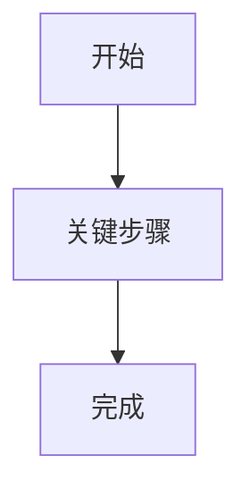

# Obsidian Diagram Pairs

Use this reference whenever Obsidian note content describes a process-like structure.

## Trigger

Create or update a diagram pair when the target note includes any of these:

- Process, workflow, operating procedure, implementation plan, or business flow
- Decision tree, branching path, routing logic, fallback path, or escalation flow
- Control flow, data flow, request flow, event flow, dependency chain, or pipeline
- Entity lifecycle, state transition, user journey, handoff, or multi-actor interaction

Do not wait for the user to explicitly ask for a diagram. If the `obsidian-vault` skill is being used and the durable content is flow-oriented, diagrams are part of the capture.

## Required Pair

For each important flow-oriented section, create both:

1. Inline Mermaid in the Markdown note.
2. A linked Obsidian Canvas `.canvas` file.

The Mermaid diagram is the compact, text-native source of truth. The Canvas file is the spatial companion for visual scanning in Obsidian.

## Placement

Place the pair directly below the content it explains:

- Under `核心流程`, `业务流程`, `数据流`, `控制流`, `生命周期`, or similar headings.
- Under the exact Q&A block when the answer describes a flow.
- Under the relevant paragraph/list/table if the note has no dedicated flow heading.

Do not put all diagrams in a generic appendix unless the user asks for an appendix.

Use this note block shape:

````markdown
### <流程名>图示



Canvas：[[<relative-vault-path>/<流程名>.canvas|打开 <流程名> Canvas]]
````

If the surrounding note uses English headings or link labels, match that style.

## Mermaid Rules

- Before writing Mermaid, use the `markdown-mermaid-writing` skill when available; at minimum follow `skills/markdown-mermaid-writing/references/mermaid_style_guide.md`.
- Pick the most specific Mermaid type:
  - Process, branch, routing, fallback, pipeline: `flowchart`
  - Multi-actor calls or message timing: `sequenceDiagram`
  - Lifecycle/status transitions: `stateDiagram-v2`
  - Time-bound plan or delivery schedule: `gantt` or `timeline`
  - User experience stages: `journey`
- Include accessibility text where the Mermaid type supports it: `accTitle` and one-line `accDescr`.
- Keep node labels short. Put detailed evidence, field names, and caveats in the note text or Canvas node body, not in every Mermaid edge.

## Canvas File Rules

Create the Canvas file in the same folder as the target note by default. If that folder already has a local Canvas convention, follow it.

Before creating a new Canvas file, search for an existing related one:

```bash
rg --files "/Users/bytedance/Documents/Obsidian Vault" -g '*.canvas' -g '!**/.obsidian*/**' -g '!**/.trash/**' | rg -i "<keyword>"
```

Naming:

- One note-level flow: `<Note Title> Canvas.canvas`
- Section-level flow: `<Note Title> - <Section Title> Canvas.canvas`
- If an existing related `.canvas` file already covers the same flow, update it instead of creating a duplicate.

Link from the note with a vault-relative wikilink:

```markdown
Canvas：[[项目/<项目名>/<Note Title> - <Section Title> Canvas.canvas|打开 <Section Title> Canvas]]
```

Canvas JSON requirements:

- Use valid JSON only. No comments, trailing commas, Markdown fences, or YAML frontmatter inside `.canvas`.
- Use text nodes by default. Use file nodes only when pointing to existing notes or attachments that improve navigation.
- Use stable lower_snake_case node IDs.
- Keep coordinates integer-based and readable: left-to-right for sequences, top-to-bottom for staged processes, branches above/below the main path.
- Use `color` sparingly for semantics: same color means same type of node in one canvas.

Minimal Canvas shape:

```json
{
  "nodes": [
    {
      "id": "start",
      "type": "text",
      "text": "开始\n\n触发条件或输入",
      "x": 0,
      "y": 0,
      "width": 300,
      "height": 140,
      "color": "4"
    },
    {
      "id": "process",
      "type": "text",
      "text": "关键处理\n\n保留字段、来源或判断条件",
      "x": 420,
      "y": 0,
      "width": 340,
      "height": 160,
      "color": "2"
    }
  ],
  "edges": [
    {
      "id": "start_to_process",
      "fromNode": "start",
      "fromSide": "right",
      "toNode": "process",
      "toSide": "left"
    }
  ],
  "metadata": {
    "version": "1.0-1.0",
    "frontmatter": {}
  }
}
```

## Update Rules

- Update Mermaid and Canvas together. Never leave one stale when changing the flow explanation.
- If a note already has a correct Mermaid diagram but no Canvas link, add the Canvas file and link.
- If a note already links a correct Canvas but has no Mermaid diagram, add Mermaid below the relevant section and keep the existing link.
- If the flow is too large, create one overview pair at the main section and one detail pair under the most important branch. Link the detail Canvas from the overview section.
- Report both changed files: the Markdown note and each `.canvas` companion.
